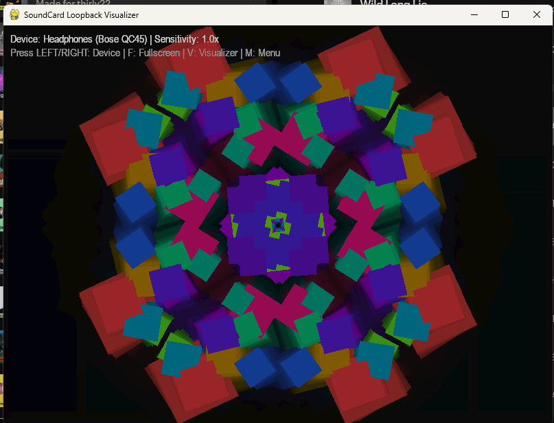
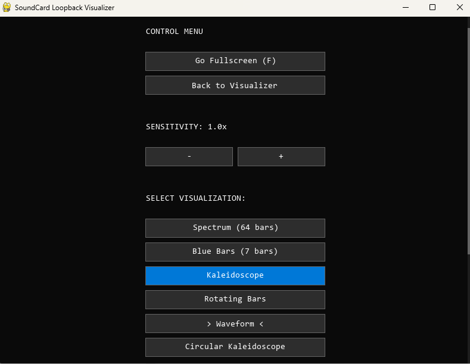
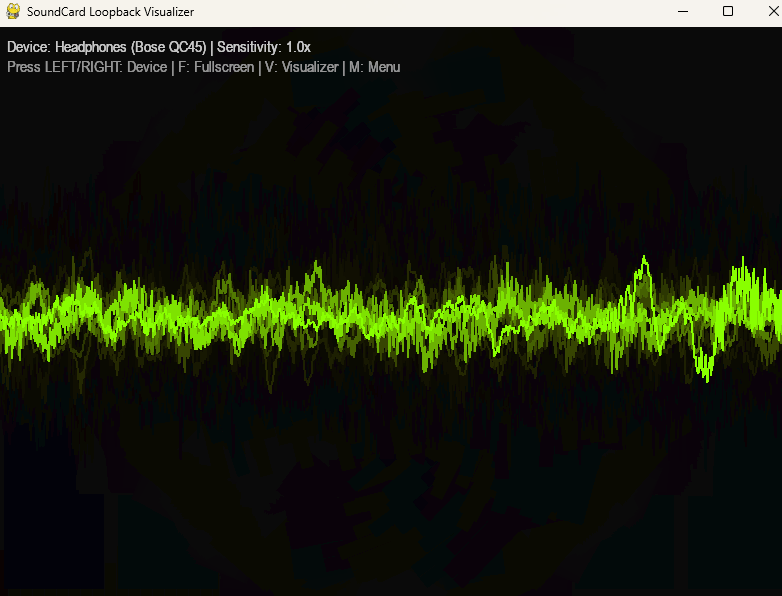

# PySoundVisualiser
Unashamedly using AI for vide coding. I tried doing this a few years ago without help, completely failed. Got this working in a few hours.

I've now added another visualisation with peak lines, and my buttons.py (yes written by me) to the project, so we can have a menu screen 
to change the settings. Top right has text, but I might remove that later as it is a small distraction. Will be thinking of more
elaborate visualisations next update I think.

A Windows-only audio visualizer written in Python. It captures system audio (loopback) using WASAPI and renders a real-time frequency spectrum using Pygame.
 
screenshots








## 🚀 Features

- **Multiple Visualizations**: 
  - **Spectrum (64 bars)**: Classic frequency spectrum with color gradients.
  - **Blue Bars (7 bars)**: Minimalist blue bars with peak tracking and trail effects.
  - **Kaleidoscope**: Dynamic 8-way symmetry with diamond-shaped particles.
  - **Rotating Bars**: Audio-reactive bars on a rotating, color-cycling surface.
  - **Waveform**: Smooth, color-cycling oscilloscope view.
  - **Circular Kaleidoscope**: Complex mandalic patterns with ripple effects, nodal scaling, and organic morphing (elliptical distortion).
- **WASAPI Loopback Capture**: Captures audio directly from your output devices (Spotify, YouTube, Games) without needing a microphone.
- **Real-time FFT Analysis**: High-performance audio processing with logarithmic scaling for a balanced musical representation.
- **Audio Sensitivity Control**: Manually adjust sensitivity (0.1x to 5.0x) to match different audio sources. Each visualizer has its own optimized default setting.
- **Dynamic Auto-Gain**: Built-in normalization to ensure visualizers remain reactive regardless of system volume.
- **Resizable Window & Fullscreen**: Seamlessly transition between windowed and fullscreen modes.
- **Interactive Device Switching**: Cycle through available audio output devices in real-time.
- **Scrollable Control Menu**: A comprehensive UI to manage settings, sound sources, and visual styles.

## 📋 Requirements

- **Operating System**: Windows 10/11 (Uses Windows-specific WASAPI)
- **Python**: 3.8 or higher
- **Dependencies**: 
  - `pygame-ce` (or `pygame`)
  - `numpy`
  - `SoundCard`

## 🛠️ Installation

1. **Clone the repository**:
   ```bash
   git clone https://github.com/yourusername/PySoundVisualiser.git
   cd PySoundVisualiser
   ```

2. **Install dependencies**:
   ```bash
   pip install -r requirements.txt
   ```

## 🎮 Usage

Run the visualizer using Python:

```bash
python main.py
```

### Controls
- **LEFT Arrow**: Switch to the previous audio device.
- **RIGHT Arrow**: Switch to the next audio device.
- **UP Arrow**: Increase audio sensitivity.
- **DOWN Arrow**: Decrease audio sensitivity.
- **F Key**: Toggle Fullscreen mode.
- **V Key**: Switch to the next visualization style (resets sensitivity to default).
- **M Key**: Open/Close Control Menu.
- **Mouse Wheel**: Scroll through the menu.
- **Resize Window**: Drag the edges of the window to change its size.
- **Close Window**: Exit the application.

## 🔍 Troubleshooting

### Bose QC45 / Bluetooth Headphones
The application specifically uses the `SoundCard` library to resolve "Invalid number of channels" errors common with Bose and Realtek drivers on Windows. If your headphones are connected, use the arrow keys to find them in the list displayed at the top-left of the window.

### "Data discontinuity" Warnings
You might occasionally see a warning about "data discontinuity in recording" in the console. This is a common notification from the underlying audio drivers when small timing jitter occurs. The application is configured to ignore these to keep the console clean, as they do not affect the visualization quality.

### No Bars Moving?
- Ensure audio is actually playing on the selected device.
- Try switching devices using the arrow keys until you see the correct output name (e.g., `Loopback: Speakers` or `Loopback: Headphones`).

## 📜 License

This project is open-source and available under the [MIT License](LICENSE).
